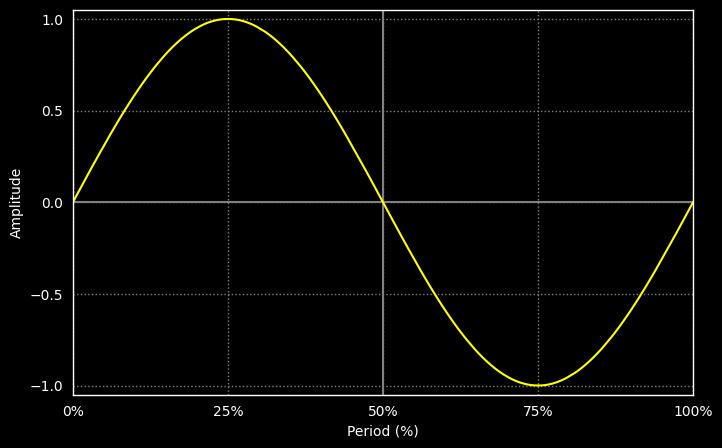

# Hantek ARB Toolkit

This project provides a set of Python scripts to work with ARB files used by Hantek oscilloscopes (DSO2000 series). It allows users to convert ARB files to CSV format, convert CSV files back to ARB, and generate PNG visualizations of waveforms from CSV data. The repository also includes sample ARB, CSV, and PNG files for testing and reference.



The scripts allow users to:

1. Convert ARB files to CSV format (`arb2csv.py`).
2. Convert CSV files back to ARB format (`csv2arb.py`).
3. Convert CSV files to PNG images (`csv2png.py`).

## About ARB Files

ARB files are binary files used by Hantek oscilloscopes to define arbitrary waveforms. Each ARB file:

- Contains a header of 8 bytes, where the first three bytes must be `"arb"`.
- Stores 4096 signed 16-bit integer values in little-endian format that represent the waveform.
- The values are scaled to the range [-1.0, 1.0].

## Scripts Overview

### `arb2csv.py`

This script converts an ARB file into a CSV file. The CSV file contains 4096 rows, where each row represents a single floating-point value in the range [-1.0, 1.0].

### `csv2arb.py`

This script converts a CSV file back into an ARB file. The CSV must contain exactly 4096 rows with floating-point values in the range [-1.0, 1.0].

### `csv2png.py`

This script converts a CSV file into a PNG image, visualizing the waveform represented by the CSV data. The script generates a simple line plot of the waveform, with:

- The x-axis representing the sample index (0 to 4095).
- The y-axis representing the waveform value (scaled between -1.0 and 1.0).

The output PNG file will have the same base name as the input CSV file.

## Examples Directory

The `examples` directory contains sample files for testing and reference, including:

- **ARB files**: Predefined waveform files.
- **CSV files**: Corresponding CSV representations of the waveforms.
- **PNG files**: Visualizations of the waveforms in PNG format.

## Prerequisites

- Python 3 or later.

## Usage

### Converting ARB to CSV

To convert an ARB file to a CSV file, use the following command:

```bash
python3 arb2csv.py <file.arb>
```

For example:

```bash
python3 arb2csv.py sine.arb
```

This will generate a file named `sine.csv` in the same directory.

### Converting CSV to ARB

To convert a CSV file back to an ARB file, use the following command:

```bash
python3 csv2arb.py <file.csv>
```

For example:

```bash
python3 csv2arb.py sine.csv
```

This will generate a file named `sine.arb` in the same directory.

### Converting CSV to PNG

To convert a CSV file to a PNG image, use the following command:

```bash
python3 csv2png.py <file.csv>
```

For example:

```bash
python3 csv2png.py sine.csv
```

This will generate a file named `sine.png` in the same directory, visualizing the waveform.

## Notes

- Ensure the CSV file contains exactly 4096 rows with valid floating-point values in the range [-1.0, 1.0].
- The scripts strictly validate file formats and will report errors if the input files are invalid.

## Contributing

If you spot a bug or want to improve the code or even improve the content, you can do the following:

- [Open an issue](https://github.com/cfgnunes/hantek-arb/issues/new)
  describing the bug or feature idea;
- Fork the project, make changes, and submit a pull request.
